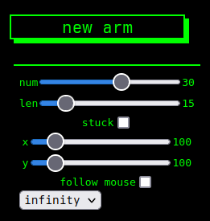

# Inverse Kinematics Playground - IKP

pínku ponsu testproject gert sumarið 2022 byggt á lýsingu [The Coding Train](https://youtube.com/thecodingtrain) og viðeigandi [myndbandi](https://youtu.be/hbgDqyy8bIw)  
notast við sömu hugmyndir og í myndbandinu en útfært á aðeins óskilvirkari máta því ég er að gera þetta í JS :(  

## stillingar
  
notast við 7 stillingar
- num, fjöldi búta sem byggja upp arminn
- len, lengd hvers og eins búts sem byggja upp arminn
- stuck, stillir hvort armurinn sé fastur í tilgreindum hnitum
- x, stillir staðsetningu fastapunkts á x-ás
- y, stillir staðsetningu fastapunkts á y-ás
- follow mouse, stillir hvort armurinn fylgi músinni eða fyrirframgreindu mynstri
- animation, stillir hvaða mynstri armurinn fyrlir, eins og er eru bara tvö munstur

## keyrsla
verkefnið er í augnablikinu að keyra á [sjomli.is](https://sjomli.is/IKP) en það er hægt að keyra það standalone með því að henda í eitt clone og nálgast index.html í browser  
*nennti ekki að hafa ehv npm dependencies þannig mæli með að nota [VSCode live server](https://github.com/ritwickdey/vscode-live-server)*
